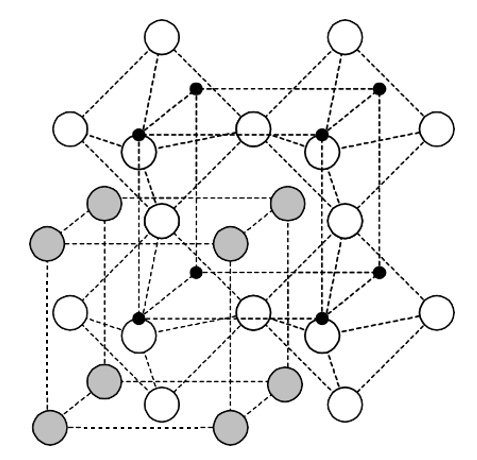
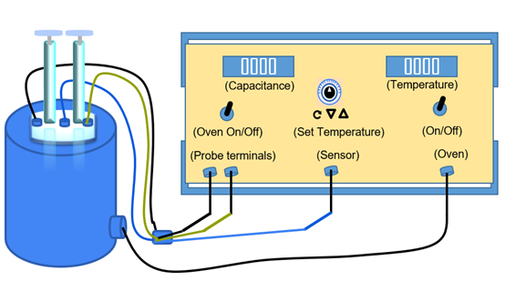
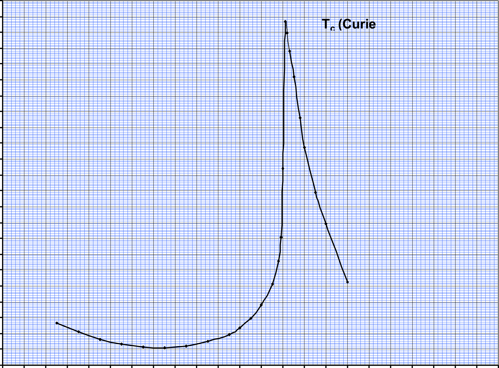

<h2>Theory: </h2>

   

      &emsp;Research in the area of Ferroelectrics is driven by the market potential of next generation memories and transducers. Thin films of ferroelectrics and dielectrics are rapidly emerging in the field of MEMS applications. Ultrasonic micro-motors utilizing PZT thin films and pyroelectric sensors using micro-machined structures have been fabricated. MEMS are finding growing application in accelerometers for air bag deployment in cars, micro-motors and pumps, micro heart valves, which have reached the commercial level of exploitation in compact medical, automotive, and space applications. Extremely sensitive sensors and actuators based on thin film and bulk will revolutionize every walk of our life with Hi-Tech gadgets based on ferroelectrics. Wide spread use of such sensors and actuators have made Hubble telescope a great success story. New bulk ferroelectric and their composites are the key components for the defense of our air space, the long coastline and deep oceans.
   

   

      &emsp;This experiment is aimed to expose the students to Dielectric and Curie Temperature Measurement technique for Ferroelectric Ceramics. Dielectric or electrical insulating materials are understood as the materials in which electrostatic fields can persist for a long time. These materials offer a very high resistance to the passage of electric current under the action of the applied direct-current voltage and therefore sharply differ in their basic electrical properties from conductive materials. Layers of such substances are commonly inserted into capacitors to improve their performance, and the term dielectric refers specifically to this application. The use of a dielectric in a capacitor presents several advantages. The simplest of these is that the conducting plates can be placed very close to one another without risk of contact. Also, if subjected to a very high electric field, any substance will ionize and become a conductor. Dielectrics are more resistant to ionization than air, so a capacitor containing a dielectric can be subjected to a higher voltage. Also, dielectrics increase the capacitance of the capacitor. 
   

   

      &emsp;Perovskite is a family name of a group of materials and the mineral name of calcium titanate (CaTiO3) having a structure of the type ABO3. Many piezoelectric (including ferroelectric) ceramics such as Barium Titanate (BaTiO3), Lead Titanate (PbTiO3), Lead Zirconate Titanate (PZT), Lead Lanthanum Zirconate Titanate (PLZT), Lead Magnesium Niobate (PMN), Potassium Niobate (KNbO3) etc. have a cubic perovskite type structure (in the paraelectric state) with chemical formula ABO3.
   

   
   
Figure: Perovskite structure (Ba: Grey; Ti: Black; O: White)

   

      &emsp;As conventionally drawn, A-site cations occupy the corners of a cube, while B-site cations sit at the body center. Three oxygen atoms per unit cell rest on the faces. The lattice constant of these perovskite is always close to the 4 Å due to rigidity of the oxygen octahedral network and the well-defined oxygen ionic radius of 1.35 Å. A practical advantage of the perovskites structure is that many different cations can be substituted on both the A and B sites without drastically changing the overall structure. Complete solid solutions are easily formed between many cations, often across the entire range of composition. Even though two cations are compatible in solution, their behavior can be radically different when apart from each other. Thus, it is possible to manipulate a material’s properties such as Curie temperature or dielectric constant with only a small substitution of a given cation. All ferroelectric materials have a transition temperature called the Curie point (Tc). At a temperature T > Tc the crystal does not exhibit ferroelectricity, while for T < Tc it is ferroelectric. On decreasing the temperature through the Curie point, a ferroelectric crystal undergoes a phase transition from a non-ferroelectric (paraelectric) phase to a ferroelectric phase.
   

   
   

