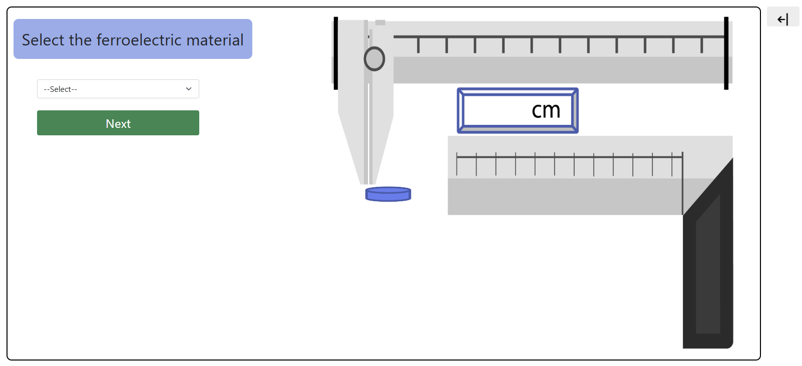
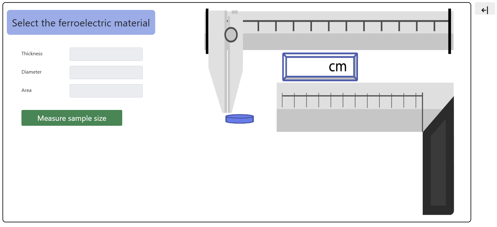
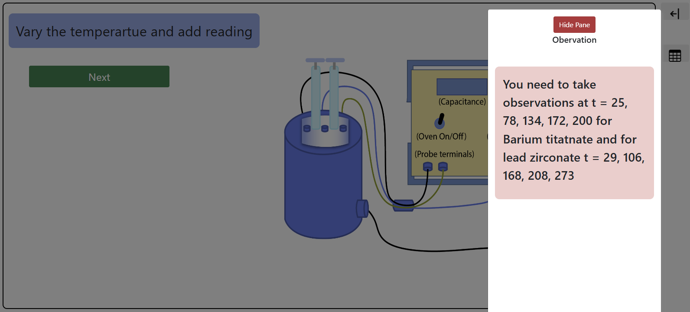
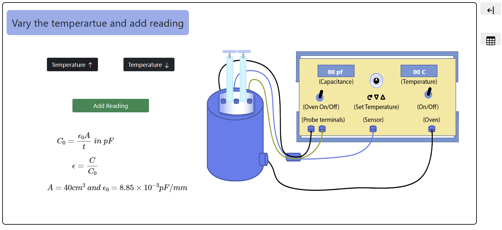
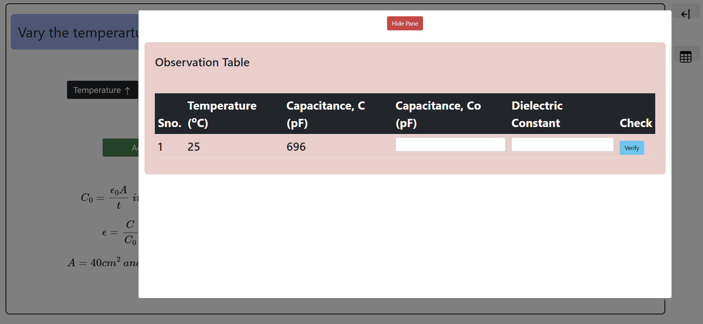
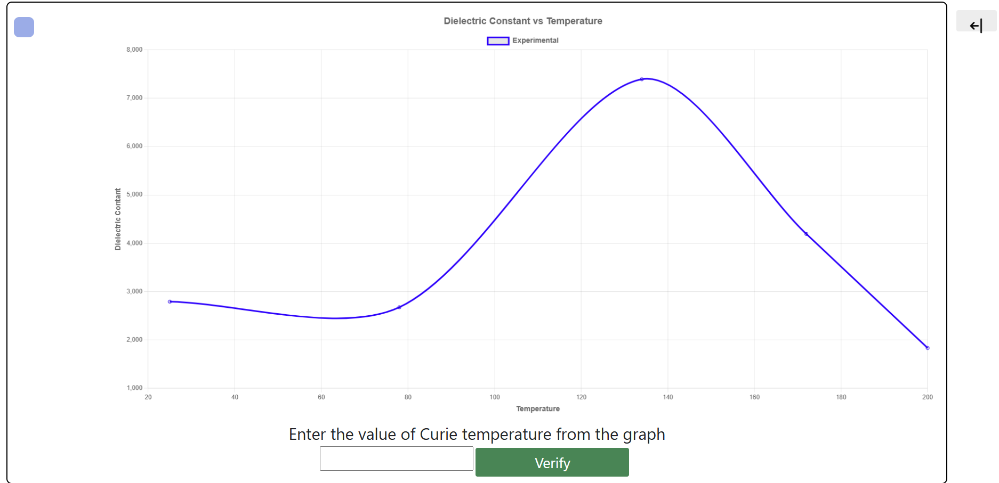

<h2>Procedure</h2>

<h3>STEP 1:</h3>

Select the ferroelectric material.

<h3>STEP 2:</h3>

Measure sample size.

<h3>STEP 3:</h3>

Follow the instruction and take the required reading.

<h3>STEP 4:</h3>

Verify Curie temperature from graph.

<h2>Results:</h2>

   Barium Titanate = 120&deg;C  
   Lead Zirconate Titanate = 210&deg;C

